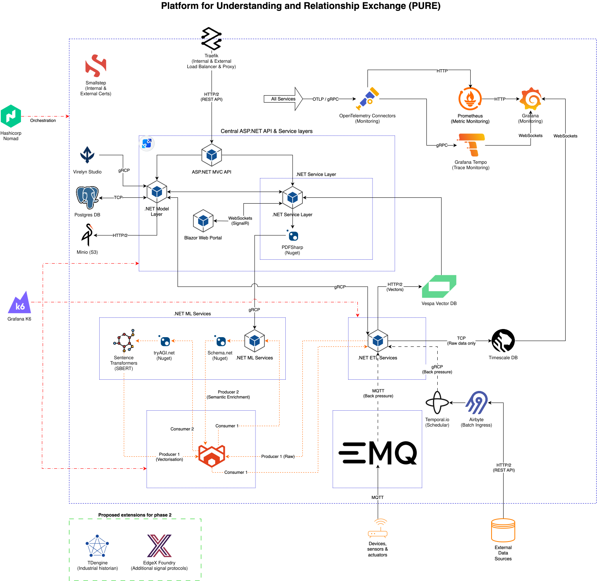

# PURE: A Platform for Understanding and Relationship Exchange
PURE (Platform for Understanding and Relationship Exchange) is an exploratory system that enriches real-time and batch data with semantic meaning, driving rapid insights across multiple disciplines.

## Requirements
* The primary thesis is to prove that multidisciplinary data from multiple sources can generate more significant insights!
* A generic architectural stack that the system can be deployed on-premises or in the cloud to support any data and privacy policy.
* Only use independent and open-source AI models.
* The system should be able to operate entirely independently, meaning that storage, networking, monitoring, etc., should be provided.
* Be open to changing technology choices and replacing any system as development progresses.
* Generate understanding and relationships with a high level of detail but simplify the system's data ingestion and movement mechanisms.
* Have a central system to manage all internal systems and provide a visual interface and API for configuration and viewing results.
* The central system should use a compiled language with multi-language interface support.

## Licence

GNU AGPLv3

## Core technology choices

| #  | Technology                     | Purpose                                                                                                         | License                              |
|----|--------------------------------|-----------------------------------------------------------------------------------------------------------------|--------------------------------------|
| 1  | ASP.NET Core                   | High-performance backend runtime for ETL daemons, internal gRPC endpoints, and service APIs                     | MIT                                  |
| 2  | Vespa                          | Search and computation engine combining vector embeddings, sparse text matching, and structured tensors         | Apache 2.0                           |
| 3  | Sentence Transformers (SBERT)  | Open-source language and feature models for generating dense embeddings and semantic representations            | Apache 2.0                           |
| 4  | PostgreSQL                     | ACID-compliant relational store for tenant configuration, relational entities, and platform metadata            | PostgreSQL License                   |
| 5  | TimescaleDB                    | Hypertable engine acting as an immutable, append-only landing zone for raw telemetry snapshots                  | Timescale License (TSL) / Apache 2.0 |
| 6  | EMQX                           | Massively scalable, distributed MQTT broker terminating field sensor sessions and protocol bridges (CoAP/LwM2M) | Apache 2.0                           |
| 7  | RabbitMQ                       | Asynchronous event bus decoupling high-throughput ingest from heavy ML embedding queues                         | MPL 2.0                              |
| 8  | MinIO                          | S3-compatible, high-performance object storage for raw artefacts, documents, and model binaries                 | AGPLv3                               |
| 9  | Traefik                        | Edge reverse proxy and dynamic load balancer for HTTP/gRPC ingress routing                                      | MIT                                  |
| 10 | Smallstep                      | Internal automated Certificate Authority (CA) managing zero-trust mTLS service-to-service identity              | Apache 2.0                           |
| 11 | Airbyte                        | ELT engine for pulling scheduled and ad-hoc batches from external third-party sources                           | ELv2                                 |
| 12 | Temporal.io                    | Resilient workflow engine orchestrating complex, fault-tolerant batch ETL lifecycles                            | MIT                                  |
| 13 | Lucene (NuGet)                 | In-process text indexing for auxiliary entity lookup within service boundaries                                  | Apache 2.0                           |
| 14 | PDFSharp (NuGet)               | Document extraction and layout manipulation engine                                                              | MIT                                  |
| 15 | Schema.net (NuGet)             | Strongly-typed semantic taxonomy vocabularies for data normalization                                            | MIT                                  |
| 16 | tryAGI.net (NuGet)             | Managed C# abstractions for local model execution and inference integration                                     | Apache 2.0                           |
| 17 | HashiCorp Nomad                | Declarative workload orchestrator deploying the stack as a unified, vertically scaled block                     | BSL 1.1                              |
| 18 | OpenTelemetry                  | Distributed tracing and metrics instrumentation across all custom .NET runtimes                                 | Apache 2.0                           |
| 19 | Prometheus                     | Time-series monitoring store scraping operational service metrics                                               | Apache 2.0                           |
| 20 | Grafana Tempo                  | High-volume distributed tracing backend mapping cross-service gRPC spans                                        | AGPLv3                               |
| 21 | Grafana                        | Centralized operational observability dashboards and visualization layer                                        | AGPLv3                               |

## Future Considerations

| #  | Technology                     | Purpose                                                                                                         | License                              |
|----|--------------------------------|-----------------------------------------------------------------------------------------------------------------|--------------------------------------|
| 1  | EdgeX Foundry                  | Industrial protocol translation framework (Modbus, BACnet, OPC-UA) bridging field hardware to EMQX              | Apache 2.0                           |
| 2  | TDengine                       | Purpose-built, high-compression industrial big-data historian for long-term time-series cold storage            | AGPLv3                               |

## Architecture

The diagram below summarises PURE's system architecture.

